# ⚡ AI Powered Code Reviewer  
### Intelligent Automated Code Review Assistant


---

## 📖 Project Overview

**AI Powered Code Reviewer** is a real-time code analysis tool designed to help developers get instant, intelligent feedback on their code. It uses an AI model to analyze source code, identify issues, and suggest improvements related to logic, readability, and best practices.

Instead of relying on manual code reviews, this platform provides **automated AI-driven feedback** that helps developers quickly understand potential problems and improve code quality. It is suitable for learning purposes, personal projects, and basic development workflows.

The project is accessible through a **web-based interface** and is also available as a **GitHub repository**.

---

## 🏗️ System Architecture

This application follows a **Client–Server–AI** architecture where the frontend, backend, and AI model work together to process and review code.

### High-Level Architecture

```mermaid
graph TD
    User((👤 User))
    WebUI[💻 Web Interface]
    Backend[⚙️ Backend API]
    Gemini[🤖 Gemini LLM API]

    User --> WebUI
    WebUI --> Backend
    Backend --> Gemini
    Gemini --> Backend
    Backend --> WebUI
```



---

## ⚙️ Application Flow

### 1. User Interface

The web interface allows users to:

- Paste or write source code
- Submit code for review
- View AI-generated feedback and suggestions

The focus is on simplicity and ease of use.

---

### 2. Backend Processing

The backend handles:

- Receiving code from the frontend
- Validating input
- Sending the code to the AI model
- Returning the AI-generated review to the frontend

---

### 3. AI Code Review (Gemini)

The system uses **Google Gemini LLM** to:

- Analyze the logic of the code
- Identify possible bugs or improvements
- Suggest cleaner and more readable approaches
- Provide general best-practice recommendations

---

## 🔄 Review Workflow

1. **User submits code**
   - Code is sent from the web interface to the backend

2. **Backend processes request**
   - Input is validated and formatted

3. **Gemini model analysis**
   - Code is sent to the Gemini LLM for review

4. **Feedback generated**
   - Gemini returns suggestions and observations

5. **Results displayed**
   - Feedback is shown to the user in the browser

---

## 🛠️ Key Features

| Feature                   | Description                          |
|---------------------------|--------------------------------------|
| **AI Code Review**        | Automated review using Gemini LLM    |
| **Instant Feedback**      | Fast response after submission       |
| **Web-Based Interface**   | No setup required for usage          |
| **Multiple Languages**    | Works with common programming languages |
| **Simple & Clean Design** | Easy to understand and use           |

---

## 🚀 Live Demo

Try the deployed application here:

➡️ https://ai-powered-code-reviewer-flax.vercel.app/

---

## 📌 Getting Started

### 1. Clone the Repository

```bash
git clone https://github.com/Rudy-123/AIPoweredCodeReviewer.git
cd AIPoweredCodeReviewer
```

### 2. Install Dependencies

```bash
pip install -r requirements.txt
```

### 3. Environment Configuration

Create a `.env` file and add your Gemini API key:

```env
GEMINI_API_KEY=your_api_key_here
```

### 4. Run the Backend

```bash
uvicorn app.main:app --reload
```

### 5. Open the Application

Open the frontend in your browser as configured in the project.

---

## 📄 License

This project is licensed under the **MIT License**.  
Refer to the `LICENSE` file for more information.

